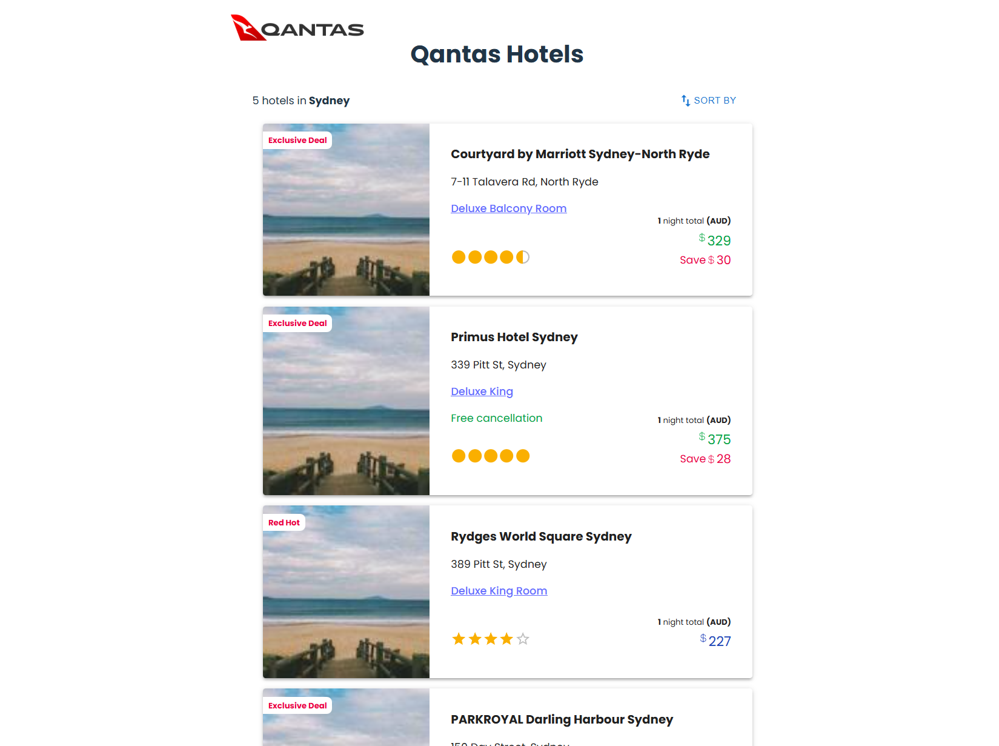

# ✈️ Qantas Group Accommodation - Hotel Booking App with Sorting Feature

This project is part of the **Qantas Group Accommodation Front-End Code Test**, designed to display a list of hotels that can be **sorted by price (low-high & high-low)**.

## 📌 **User Story**

> As a user of Qantas Hotels, I would like to see a list of hotels that can be sorted by price.


## 🎯 **Approach & Trade-offs**

### ✅ **Technologies Used**
- **React** – For building the UI.
- **Material UI** – For pre-styled components.
- **Tailwind CSS** – For additional styling flexibility.
- **TypeScript** – For type safety and maintainability.
- **Vitest & React Testing Library** – For unit testing.
- **ESLint & TypeScript ESLint** – For enforcing clean code.
- **react-icons** – For icon library.
- **@fontsource/poppins** – For Custom font.


### 🏗 **Accessible & Extensible Code Design**
To ensure **maintainability and scalability**, the project is structured with **modular components** and **TypeScript for strict type safety** for future developments. Below are the key architectural decisions:

1. **Separation of Concerns**  
   - The UI is divided into **reusable and stateFull components** (`HotelCard`, `RatingComponent`, `SortSelector`) and **stateLess components** (`HotelList`) for better readability and future extensibility.
   - The **sorting logic is handled separately** in `SortSelector.tsx` instead of being embedded in the hotel list, keeping it modular.

2. **Type Safety with TypeScript**  
   - A **separate TypeScript file (`hotelCardTypes.ts`)** defines the structure for hotel data, ensuring consistency across the application.
   - This makes the codebase **easier to maintain** and helps catch potential errors early.

3. **Future Extensibility**  
   - If API-based sorting becomes available, sorting logic can be updated **without affecting UI components**.
   - More sorting/filtering options can be easily added by extending `SortSelector.tsx`.

### ⚖️ **Trade-offs Made**
1. **Minimal UI Adjustments**:  
   - The design is inspired by the provided mockup but is **not pixel-perfect**.
   - Used **Material UI & Tailwind CSS** for rapid styling instead of writing custom styles.
  
2. **Sorting Functionality**:  
   - Sorting is performed **client-side** for simplicity.
   - If API sorting were available, it would be **delegated to the backend** for better performance.

3. **Testing Strategy**:  
   - Focused on **unit tests** rather than **end-to-end tests (E2E)** due to time constraints.
   - Covered **components, sorting logic, and API fetch handling**.

---

## 🚀 **Features Implemented**
✅ Fetches hotel data from the provided JSON API.  
✅ Displays a **sortable list of hotels**.  
✅ Implements **two sorting options**:
   - **Price (Low-High)**
   - **Price (High-Low)**  
✅ Uses **star vs. self ratings** (stars vs. circles) correctly.  
✅ **Unit-tested** key components and API logic.  

---

## 📸 **Preview**
  

---

## 📂 **Project Structure**
```
📂 src
 ┣ 📂 assets
 ┃ ┗ 📜 test-tesult-preview.png          # screenshot of end result
 ┃ 
 ┣ 📂 api
 ┃ ┗ 📜 hotelsAPI.ts          # API function to fetch hotel data from a JSON source
 ┃ 
 ┣ 📂 components
 ┃ ┣ 📜 HotelCard.tsx         # Displays individual hotel details (title, price, image, rating)
 ┃ ┣ 📜 RatingComponent.tsx   # Displays hotel ratings using stars or circles based on type
 ┃ ┣ 📜 SortSelector.tsx      # Sorting menu allowing users to sort hotels by price
 ┃ 
 ┣ 📂 tests
 ┃ ┣ 📂 components
 ┃ ┃ ┣ 📜 HotelCard.test.tsx  # Unit tests for the HotelCard component
 ┃ ┃ ┣ 📜 RatingComponent.test.tsx  # Unit tests for the RatingComponent
 ┃ ┃ ┗ 📜 SortSelector.test.tsx  # Unit tests for sorting logic
 ┃ ┗ 📂 api
 ┃   ┗ 📜 hotelsAPI.test.ts   # Tests API fetch and error handling
 ┃
 ┣ 📂 types
 ┃ ┗ 📜 hotelCardTypes.ts     # TypeScript type definitions for hotel data
 ┃
 ┗ 📜 App.tsx                 # Main entry point, renders the HotelsList component
 ┗ 📜 App.css                 # Applys the Style for Font Family and body structure
 ┗ 📜 HotelsList.tsx        # Renders a list of hotel cards with sorting functionality
```

---

## 🛠 **Setup & Running Instructions**

### **1️⃣ Prerequisites**
Ensure you have the following installed:
- **Node.js** (>= 16.x)
- **npm** or **yarn**

### **2️⃣ Clone the Repository**
```sh
git clone https://github.com/Samira-frd/hotel-booking-app
cd hotel-booking-app
```

### **3️⃣ Install Dependencies**
Using npm:
```sh
npm install
```

### **4️⃣ Run the Application**
To start the development server, run:
```sh
npm run dev
```
This will start the application at **`http://localhost:5173`**.

---

## 🧪 **Running Tests**
This project uses **Vitest** for unit testing.

### **1️⃣ Run All Tests**
```sh
npm run test
```

### **2️⃣ Run Tests in Watch Mode**
```sh
npx vitest --watch
```

### **3️⃣ Check Test Coverage**
```sh
npx vitest --coverage
```
This will generate a test coverage report.

---

## 📜 **Deliverables**
This project includes:
✅ **Source code**  
✅ **Fully tested components**  
✅ **Commit history with meaningful messages**  
✅ **Instructions for running the app & tests**  
✅ **README with approach details & trade-offs**  

---

## 🤔 **If More Time Was Available...**
If additional time were available, the following enhancements would be prioritized:
1. **Improve UI Styling**  
   - Match the mockup more closely, refine spacing & alignment.

2. **Implement Backend Sorting**  
   - Offload sorting logic to the server for better scalability.

3. **Add End-to-End (E2E) Testing**  
   - Use **Cypress or Playwright** for full integration tests.

4. **Add More Unit Tests for Full Coverage**  
   - Add **App.tsx, HotelList.tsx** to ensure full functionality is tested.

---

## 🎯 **Key Takeaways**
✅ **Clean, well-structured code following best practices**  
✅ **Tested core functionality for reliability**  
✅ **Prioritized readability & maintainability**  

---

## 🔗 **Contact**
For any questions or suggestions, feel free to reach out.

📧 **Email:** samira.frd@hotmail.com  
📌 **GitHub:** ([https://github.com/Samira-frd](https://github.com/Samira-frd))  

---

**🚀 Thanks for reviewing this project! Looking forward to discussing it.** 🎉
